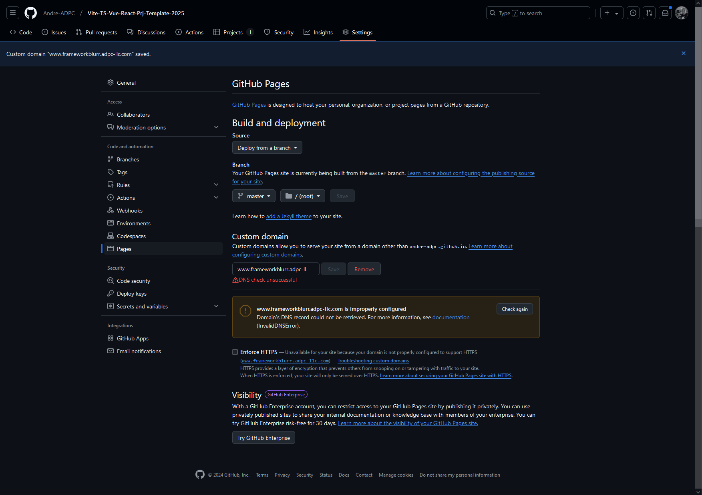

# A Cross-Framework Vite-TS-Vue-React Project Template-2025

<p align="center">
</p>

Is an experiment to see how tricky and convoluted things might or might not get when you build the exact same App with two JS frameworks at the same time, in the same Repo and then compare their performance, quirks, pains and gains alongside each other on the same hardware, using the same complimentary assets.

It is a continued WIP, growing into the shape I'm looking to achieve every week.

This template should help get you started developing with Vite and TypeScript in Vue.JS 3 and React 19 in the same house. Various Testing and CSS technologies are made available and applied by default.

The project is Domain-Driven Design-based and applies best-practice TDD approaches using Model-Driven evaluation, and Behavioural-Driven Design followed by Unit, Functional, Component, Integration, and End-to-End testing running on both the Playwright and Cypress testing frameworks. I've also included both Vitest and Jest to play around with Unit and Integration testing functionality.

Playwright and Cypress will be put through their paces to see how broad and wide they can be pushed to function from Unit testing all the way through to E2E testing.

For details on how the Project Template is structured, a VitePress Documentation section will be added to the repository's **[DOCS](./DOCS/)** folder once everything is working reliably in the intended starting configuration. You can, if you feel the need, refer to the details covering each section, and expand on those when shaping the template as per your unique project requirements.

## Recommended IDE Setup

[VSCode](https://code.visualstudio.com/) + [Volar](https://marketplace.visualstudio.com/items?itemName=Vue.volar) (and disable Vetur).

Refer to the `.vscode` configuration file for the recommended extensions. Should other IDEs be preferred, please refer to their respective extension marketplaces for suitable equivalents.

## Type Support for `.vue` Imports in TS

TypeScript cannot handle type information for `.vue` imports by default, so we replace the `tsc` CLI with `vue-tsc` for type checking. In editors, we need [Volar](https://marketplace.visualstudio.com/items?itemName=Vue.volar) to make the TypeScript language service aware of `.vue` types.

Strict Types are applied by default, and various TypeScript IDE tools are used to assist with making the DX clear, controlled and feature-rich, while driven by high quality standards, and practices.

We have added all the key _VS Code Extensions_ we use under the `.vscode` folder. Look out for the `extensions.json` file, they are listed there.

## Customize configuration

See the [Vite Configuration Reference](https://vite.dev/config/).
See the [TypeScript TSConfig Reference](https://www.typescriptlang.org/tsconfig/).

## Project DevOps Employs a Jenkins CI/CD Workflow

The project is served by a locally installed Jenkins Server tunnelled to GitHub via Cloudflare's tunnelling technology. This specific template project will thus be kept up to date and managed in a suitable CI/CD pipeline workflow suited to the various and dynamic platform and framework integrations.

## Detailed Project Scope

For more detail please refer to the **[DOCS](./DOCS/)** folder for now.
The [project's tree](./DOCS/Project_Tree.MD) will give you a bird's eye view of the general layout and how the pieces are interacting. Most, hopefully all, custom JS files will be converted to TypeScript to allow for future maintainability as well as flexibility to test the code in situ, while development progresses.

The Jenkins pipeline is a multi-branch type and is getting structured to accommodate a TDD approach instead of doing Unit and Integration testing as an afterthought. An example [Jenkinsfile](./Jenkins/JenkinsfileExample) will illustrate how the CI/CD process will ultimately function from "_continuous commits_" through to continuous deployments while the Jenkins server is based on my local machine getting triggered by the Repo's _webhook_ designed for that specific purpose.

To set up a Jenkins Server on your local machine as preferred, follow the [official Jenkins documentation](https://www.jenkins.io/doc/) while also referring to the local [Jenkins documentation](./DOCS/Build%20a%20Jenkins%20Pipeline.md) in this repository to get started.

Ensure you configure a Pipeline with matching characteristics, then simply apply the `Jenkinsfile` available in this repository.

## General Project Setup

**NOTE**: The commands here are varied and growing, the final versions will be added here once they have been tested and gotten to work as expected. For more detail on the current **NPM Scripts** available to run, refer to the `"scripts": {...},` section in the **[package.json](./package.json)** file.

### Installing Packages from `package.json`

```sh
npm install
```

### Compile and Hot-Reload for Development

```sh
npm run dev
```

### Lint with [ESLint](https://eslint.org/) & [OXLint](https://oxc.rs/)

```sh
npm run lint                    # Using ESLint and OXLint
npm run lint:eslint             # Using ESLint
npm run lint:oxlint             # Using OXLint
```

### Type-Check, Compile and Minify for Production

```sh
npm run build
```

### Running Tests with [Vitest](https://vitest.dev/) & [Jest](https://jestjs.io/)

We can apply Vitest and Jest in various ways while building the project and these initial scripts are available.

```sh
npm run test:unit     # Using Vitest
npm run test:vue      # Using Vitest, Cypress and Playwright
npm run test:react    # Using Jest, Cypress and Playwright
npm run test:all      # Using Vitest, test:vue, and test:react

```

### Running Tests with [Playwright](https://playwright.dev/) & [Cypress](https://cypress.io/)

Component, Functional and E2E tests can each be ran with their respective scripts.

```sh
npm run test:component:cypress  # Using Cypress
npm run test:e2e:cypress        # Using Cypress
npm run test:e2e:playwright     # Using Playwright
npm run test:vue                # Using Vitest, Cypress and Playwright
npm run test:react              # Using Jest, Cypress and Playwright
```

## Linking to the Project's Custom Domain on GitHub Pages

The **[Vite-TS-Vue-React-Prj-Template-2025](https://github.com/Andre-ADPC/Vite-TS-Vue-React-Prj-Template-2025)** repository is **both** a user and an [Iterative Development Project](https://github.com/users/Andre-ADPC/projects/2/views/1) repo type.

**NOTE**: Depending on whether you have a registered TLD or Apex domain with some service provider or not, is where most of the confusion comes in, IMO. So before jumping in you need to step back a bit and consider your own unique situation and then decide which approach would be best-suited for your particular use-case.\*

Here are a few (_non-exhaustive_) scenarios to hopefully set you off in the right direction:
I am being verbose in each case as these <u>subtle differences</u> make **_ALL the difference_**.

1. You only have a **Personal GitHub account** and want to host a _personal project_ on GitHub Pages.
2. You have an **Organizational GitHub account** and want to host an _organizational project_ on GitHub Pages.
3. You have a **Registered TLD**, and a **Personal GitHub account** and want to host a _personal project_ on GitHub Pages.
   - You have a **Registered TLD** only and wish to use the domain as the target URL to host a _personal project_ on GitHub Pages.
   - You have a **Registered TLD** and a **subdomain** of the TLD and wish to use the **subdomain** as the target URL to host a _personal project_ on GitHub Pages.
4. You have _similar_, but **subtly different** scenarios than the ones described above.

**In this particular case the scenario is as follows**: I have a subdomain hosted on my _very entry-level_ Hetzner Cloud VPS, and it's routed through Cloudflare's WAF, SSL/TLS, and DNS services among other DevOps & DevSecOps utilities. I will be hosting this project's Backend on the Hetzner VPS (a Headless WordPress instance) and want the Landing Page, a simple HTML + Tailwind template "Frontend" hosted on GitHub Pages. Yes, Cloudflare Pages would probably have been an easier solution, but we'll get to it in due course, for we'll be hosting the **Vue** and **React** portions of the project on [Cloudflare Pages](https://pages.cloudflare.com/). I want to host the `Landing Page` portion of the project on GitHub Pages. Additionally I want it discoverable through all-inclusive URL approaches like:

- `https://www.frameworkblurr.adpc-llc.com`,
- `https://frameworkblurr.adpc-llc.com`,
- `www.frameworkblurr.adpc-llc.com` and,
- `frameworkblurr.adpc-llc.com`.

I have my Organizational account with GitHub as well as two personal accounts. As mentioned, this project is based in my main personal account. Based on the [question found on SO](https://stackoverflow.com/questions/9082499/custom-domain-for-github-project-pages#9123911) I found it to be the most relevant one, so I went and configured the required DNS settings and applied my SSL/TLS certificates as managed via my setup on Cloudflare, while using the guidance of a good answer to these questions as shown below.

To get this done with the least pain, forget GitHub's documentation as it's all over the place, non-linear as the author mentioned, and quite convolutedly disconnected, IMO. So referring to [this post by Ryan Pendergast](https://stackoverflow.com/a/9123911/19977074) on Stackoverflow I managed to make sense of how to get it set up for this slightly more involved configuration.

### Using the `master branch` of the Repo as Source on GitHub Pages

In the guidance it mentions the following:

> 3. Choosing `master branch` will treat `/README.md` as your web `index.html`. Choosing `master branch /docs` folder will treat `/docs/README.md` as your web `index.html`.
> 4. Choose a theme.

The current workflow for creating a new GitHub Pages deployment was not experienced exactly as per the flow described in the SO answer mentioned. Refer to the screenshot further below.

**NOTE**: I initially added the `www` subdomain prefix in this example to demonstrate the "_ensuing chaos_" that can occur in my specific scenario, but again, this is one of the _subtleties_, in my case it was a battle between setting up the DNS records in Cloudflare with assumed settings as gleaned from Ryan's SO post, vs what GitHub Pages' current DNS Record inspection spits out when the `www` prefix is used.

A good place to start would be to ask "WHAT" is the `www` prefix there for in a domain?
OK, so a common explanation you will find mostly is the following:

> The "www" stands for World Wide Web and is a subdomain commonly used to indicate that a website is accessible via the internet.

Let's have a deeper look at how a **web address** or also commonly known as a "_**link**_" is constructed as well as how a Universal Identifier technically called a **Universal Resource Locator (URL)** is applied by humans and how computers, network routers, switches and search engines understand them in order to route us to the correct web address.

Things are more convoluted and there are thousands of questions related to the following "variants" of "_**links**_" in reference to the Internet.

I recommend we start this path off from some form of neutral authoritative ground, without re-explaining it here in detail, I refer you to two references to get onto the right path to finding answers:

1. Mozilla Developer Network's (MDN) [World Wide Web](https://developer.mozilla.org/en-US/docs/Glossary/World_Wide_Web) documentation.
2. Mozilla Developer Network's (MDN) [Choosing between www and non-www URLs](https://developer.mozilla.org/en-US/docs/Web/URI/Authority/Choosing_between_www_and_non-www_URLs) documentation.

<div style="align: center; text-align:center;">
<div class="caption">The initial Custom Domain Configuration Attempt</div></div><br>

The steps at date of publishing this (15th Dec 2024), the setup steps on GH Pages were as follows:

### GitHub Pages

[GitHub Pages](https://pages.github.com/) is designed to host your personal, organization, or project pages from a GitHub repository.

#### Build and deployment

Source

<p><button><span><strong>Deploy from a Branch</strong><svg aria-hidden="true" height="16" viewBox="0 0 16 16" version="1.1" width="16" data-view-component="true" class="octicon octicon-triangle-down">
    <path d="m4.427 7.427 3.396 3.396a.25.25 0 0 0 .354 0l3.396-3.396A.25.25 0 0 0 11.396 7H4.604a.25.25 0 0 0-.177.427Z"></path>
</svg></span></button></p>

`Branch`
Your GitHub Pages site is currently being built from the master branch. [Learn more about configuring the publishing source for your site](https://docs.github.com/articles/configuring-a-publishing-source-for-github-pages/).

<p><button><span><svg aria-hidden="true" height="16" viewBox="0 0 16 16" version="1.1" width="16" data-view-component="true" class="octicon octicon-git-branch color-fg-muted">
    <path d="M9.5 3.25a2.25 2.25 0 1 1 3 2.122V6A2.5 2.5 0 0 1 10 8.5H6a1 1 0 0 0-1 1v1.128a2.251 2.251 0 1 1-1.5 0V5.372a2.25 2.25 0 1 1 1.5 0v1.836A2.493 2.493 0 0 1 6 7h4a1 1 0 0 0 1-1v-.628A2.25 2.25 0 0 1 9.5 3.25Zm-6 0a.75.75 0 1 0 1.5 0 .75.75 0 0 0-1.5 0Zm8.25-.75a.75.75 0 1 0 0 1.5.75.75 0 0 0 0-1.5ZM4.25 12a.75.75 0 1 0 0 1.5.75.75 0 0 0 0-1.5Z"></path>
</svg><strong> master </strong><svg aria-hidden="true" height="16" viewBox="0 0 16 16" version="1.1" width="16" data-view-component="true" class="octicon octicon-triangle-down">
    <path d="m4.427 7.427 3.396 3.396a.25.25 0 0 0 .354 0l3.396-3.396A.25.25 0 0 0 11.396 7H4.604a.25.25 0 0 0-.177.427Z"></path>
</svg></span></button>  <button><span><svg aria-hidden="true" height="16" viewBox="0 0 16 16" version="1.1" width="16" data-view-component="true" class="octicon octicon-file-directory-fill color-fg-muted">
    <path d="M1.75 1A1.75 1.75 0 0 0 0 2.75v10.5C0 14.216.784 15 1.75 15h12.5A1.75 1.75 0 0 0 16 13.25v-8.5A1.75 1.75 0 0 0 14.25 3H7.5a.25.25 0 0 1-.2-.1l-.9-1.2C6.07 1.26 5.55 1 5 1H1.75Z"></path>
</svg><strong> / (root) </strong><svg aria-hidden="true" height="16" viewBox="0 0 16 16" version="1.1" width="16" data-view-component="true" class="octicon octicon-triangle-down">
    <path d="m4.427 7.427 3.396 3.396a.25.25 0 0 0 .354 0l3.396-3.396A.25.25 0 0 0 11.396 7H4.604a.25.25 0 0 0-.177.427Z"></path>
</svg></span></button>   <span><button><strong>Save</strong><svg aria-hidden="true" height="16" viewBox="0 0 16 16" version="1.1" width="16" data-view-component="true" class="octicon octicon-triangle-down">
    <path d=""></path></button></span></p>

Learn how to [add a Jekyll theme](https://docs.github.com/pages/setting-up-a-github-pages-site-with-jekyll/adding-a-theme-to-your-github-pages-site-using-jekyll) to your site.

#### Custom domain

Custom domains allow you to serve your site from a domain other than `andre-adpc.github.io`. [Learn more about configuring custom domains](https://docs.github.com/pages/configuring-a-custom-domain-for-your-github-pages-site).

<p><span><button> www.frameworkblurr.adpc-llc.com </button></span>  <span><button> Save </button></span>  <span><button> Remove </button></span></p>
<p><span><svg aria-hidden="true" height="16" viewBox="0 0 16 16" version="1.1" width="16" data-view-component="true" class="octicon octicon-alert mr-0 color-fg-danger">
    <path d="M6.457 1.047c.659-1.234 2.427-1.234 3.086 0l6.082 11.378A1.75 1.75 0 0 1 14.082 15H1.918a1.75 1.75 0 0 1-1.543-2.575Zm1.763.707a.25.25 0 0 0-.44 0L1.698 13.132a.25.25 0 0 0 .22.368h12.164a.25.25 0 0 0 .22-.368Zm.53 3.996v2.5a.75.75 0 0 1-1.5 0v-2.5a.75.75 0 0 1 1.5 0ZM9 11a1 1 0 1 1-2 0 1 1 0 0 1 2 0Z"></path>
</svg></span>  <span>DNS check unsuccessful</span></p>

---

<div style="display: flex; justify-content:space-between;"><div style="margin: 4px;"><svg height="42" aria-hidden="true" viewBox="0 0 24 24" version="1.1" width="42">
    <path d="M12 7a.75.75 0 0 1 .75.75v4.5a.75.75 0 0 1-1.5 0v-4.5A.75.75 0 0 1 12 7Zm0 10a1 1 0 1 0 0-2 1 1 0 0 0 0 2Z"></path><path d="M7.328 1.47a.749.749 0 0 1 .53-.22h8.284c.199 0 .389.079.53.22l5.858 5.858c.141.14.22.33.22.53v8.284a.749.749 0 0 1-.22.53l-5.858 5.858a.749.749 0 0 1-.53.22H7.858a.749.749 0 0 1-.53-.22L1.47 16.672a.749.749 0 0 1-.22-.53V7.858c0-.199.079-.389.22-.53Zm.84 1.28L2.75 8.169v7.662l5.419 5.419h7.662l5.419-5.418V8.168L15.832 2.75Z"></path></svg></div><div><div class="overflow-hidden ">
            <div>www.frameworkblurr.adpc-llc.com is improperly configured.</div>
            <div>Domain's DNS record could not be retrieved. For more information, see<a href="https://docs.github.com/articles/setting-up-a-custom-domain-with-github-pages/"> documentation</a>
            </div>
            <div>(InvalidDNSError).</div>
        </div></div><div><button>Check again</button></div></div>
</div>

---

<p><input type="checkbox" name="pages_https_redirect" value="1" id="pages-https-redirect-feature" disabled=""><strong> Enforce HTTPS</strong> — <span><small>Unavailable for your site because your domain is not properly configured to support HTTPS (<u><a href="https://www.frameworkblurr.adpc-llc.com/">www.frameworkblurr.adpc-llc.com</a></u>) — <u><a href="https://docs.github.com/articles/troubleshooting-custom-domains/#https-errors">Troubleshooting custom domains</a></u>.

HTTPS provides a layer of encryption that prevents others from snooping on or tampering with traffic to your site.
When HTTPS is enforced, your site will only be served over HTTPS. <u><a href="https://docs.github.com/articles/troubleshooting-custom-domains/#https-errors">Learn more about securing your GitHub Pages site with HTTPS</a></u>.</span></small></p>

---

### Resolving the Issue

All the above might be a bit unnerving, especially for folks who are not sure at all on how to navigate the "mysterious waters" of DNS, `A` records, `CNAME` conventions, etc. all that confidently just yet. However, there's no need to be concerned at this point. We have to start the process somewhere, and in most cases the logical thought process is to do so from the `source`, in this case the GitHub Repository we wish to publish on a live website.

As you will notice all these "_red flags_" are not revealed as explicitly in Ryan's post on Stackoverflow, but they would be when the process was started from the **GitHub Pages** UI

#### Configuring Secure HTTPS Connectivity

Should you experience trouble with configuring SSL/TLS connections, you can refer to GitHub Pages' documentation [Securing your GitHub Pages site with HTTPS](https://docs.github.com/en/pages/getting-started-with-github-pages/securing-your-github-pages-site-with-https) you'll be guided to add a layer of encryption that prevents others from snooping on or tampering with traffic to your site.

There's a handy AI Chat interface which will run an analysis to the extent of its abilities and guide you through potential issues.

It was so in this particular configuration's case and here's an excerpt of the chat:

##### Virtual Assistant
